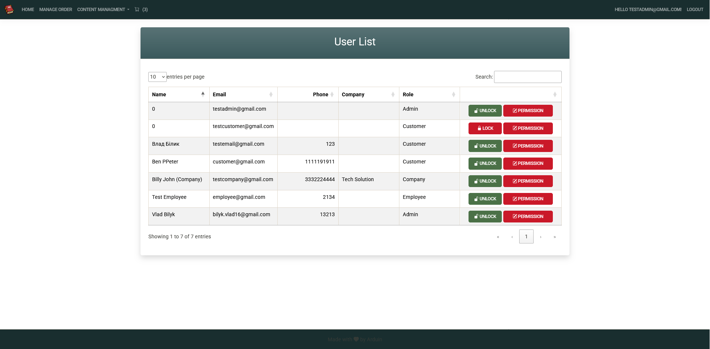

## BulkyMVC - E-commerce App

This is an ASP.NET Core MVC-based e-commerce platform built as part of the Udemy course 
".NET Core MVC - The Complete Guide 2024 [E-commerce] [.NET 8]". 

It includes product management, authentication, order management, Stripe payments, 
and an admin panel for managing users and orders.

[certificate](https://ude.my/UC-05252146-16c4-4c5a-8274-f919ba42e4ba)

## 🚀 Live demo
[BulkyMVC - Live on Azure](https://bulkymvc-vladbilyk-bfgdeyfthkacdugn.polandcentral-01.azurewebsites.net)


## 📚 What I Learned in This Course

### 🔹 ASP.NET Core MVC & Razor Pages
- Learn the structure of ASP.NET Core MVC (.NET 8)
- Learn the structure of ASP.NET Core Razor Pages
- Custom Tag Helpers, View Components, Partial Views

### 🔹 Database & Entity Framework
- Integrate Entity Framework with code-first migrations
- Repository Pattern for database access
- Seed Database Migrations Automatically
- Sessions & TempData in ASP.NET Core

### 🔹 Authentication & Authorization
- Identity Framework with custom user fields
- Authentication & Role-based Authorization
- Role Management in ASP.NET Core Identity

### 🔹 Features & Integrations
- Email notifications
- Stripe Payment Gateway
- Deploying to Microsoft Azure

### Some screenshots from the project


Main page


Register Page


Product Details Page


User List Page - Admin view


Order List Page


Order by Customer


Order settings - Admin view

## 🛠 How to Run Locally

1. **Clone the repository**  
   ```sh
   git clone https://github.com/Vlad-Bilyk/Bulky_MVC.git
2. Update the database connection string
- Open appsettings.json
- Find the "ConnectionStrings" section and update "DefaultConnection" with your database connection:
	```json
	"ConnectionStrings": {
      "DefaultConnection": "Server=YOUR_SERVER_NAME;Database=Bulky;Trusted_Connection=True;TrustServerCertificate=True"
	}
3. Apply database migrations
- Open Visual Studio
- Go to Tools → NuGet Package Manager → Package Manager Console
- Select Default project: BulkyBook.DataAccess
- Run the following command:
	```sh
	update-database
4. Restore dependencies
- Open console and run command
	```sh
	dotnet restore